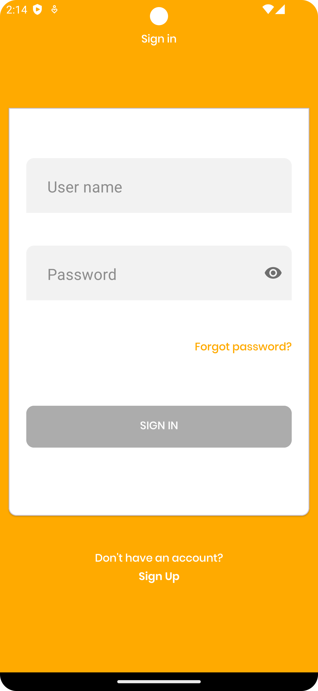
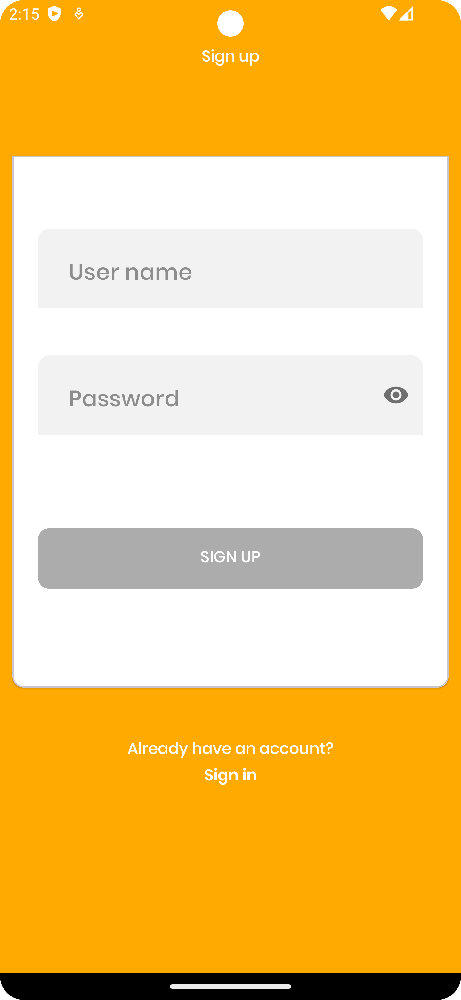
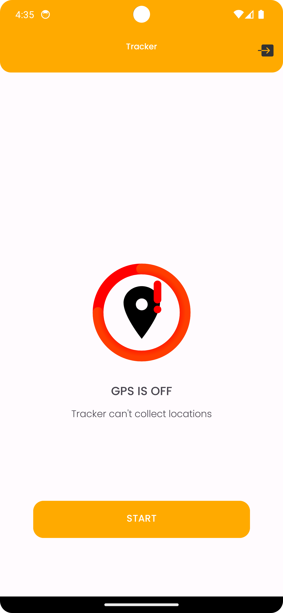
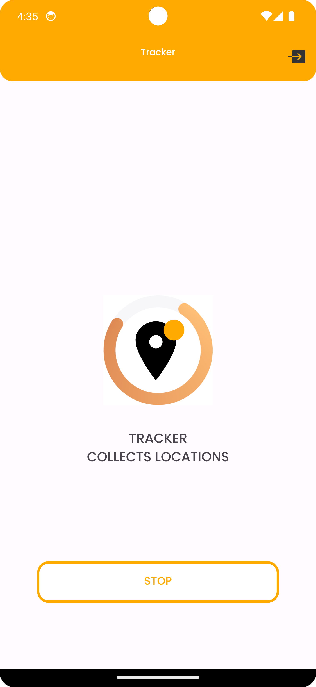
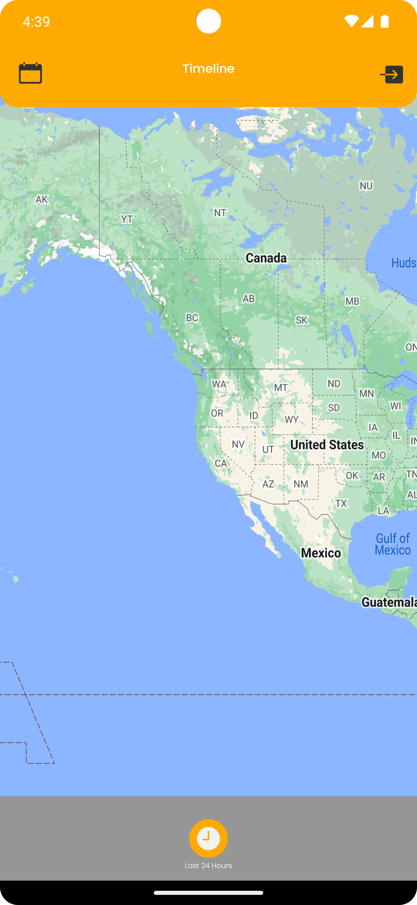
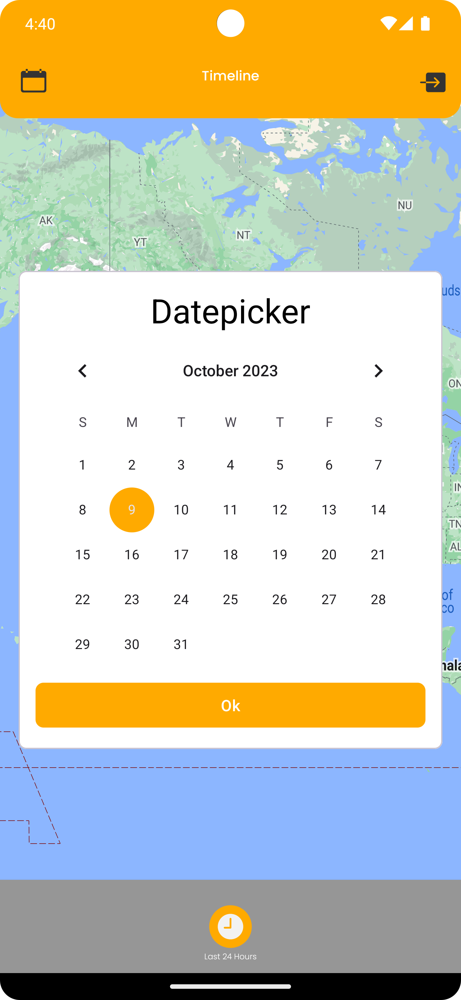
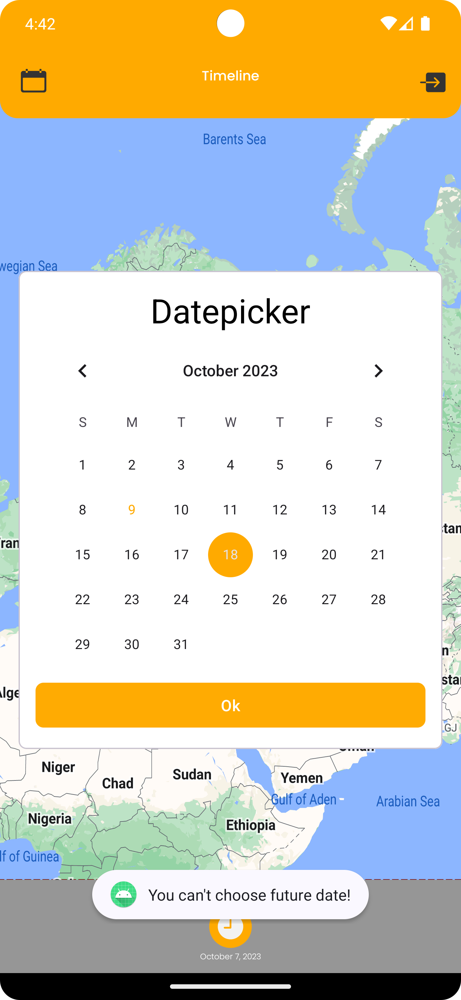
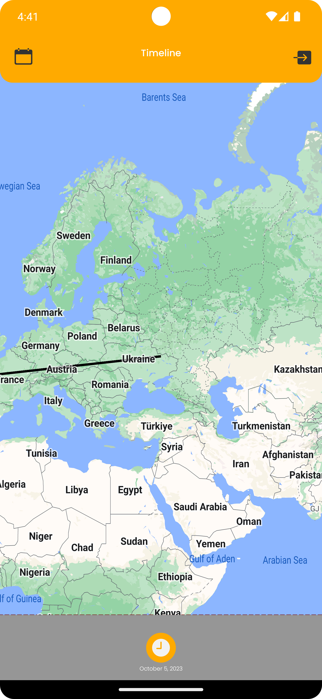
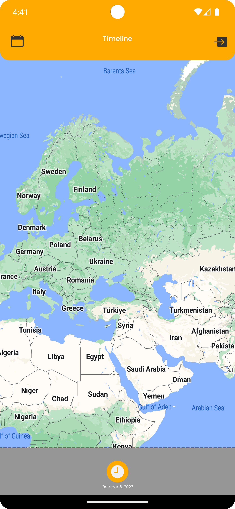

Hi, my name is Andrii, and welcome to the Tracker + Map project!

## What I used in this project:

- Java
- Android Framework
- ViewBinding
- LiveData
- RxJava
- DialogFragment
- WorkManager
- Firebase Authentication, Firestore
- Google Maps API
- Dagger Hilt for DI
- Clean architecture + MVI
- JUnit
- Espresso

This app contains 2 modules and 1 library. Authentication functions + Login and Register screens inside the library. Two modules use this library for authentication and have the same user's credentials.
## Project overview:

#### Tracker module:
When you first open the app, you'll see a Sign-in screen, if the user hasn't an account yet, he/she can create it. Just click on the Sign Up link:

After successfully login/registering user sees the main screen:

Or, if his/her device was turned off GPS Location:

When the user clicks on the button, starts tracking the location and sends it to Firestore. If the user has some problems with the Internet connection - the data will be saved locally and sent later.

Also, the user can log out by clicking on the Exit icon in the top right corner.

#### Map module:

Has the same authentication screens as the tracker, because they use the same library and the same credentials.

When the user successfully login to the app he will see the map and Path (if exist) within the last 24 hours. In our example, we have no locations today.

Clicking on the calendar icon user can choose the date.

If the user chosen the future date, the error shows:

If the date was correct and in that date, he/she tracked location -> build the path:

And if after that, the user choose another day (without locations) shows an empty map:

Thank you for your interest in my project. Feel free to explore the code and project structure. If you have any questions or suggestions, please don't hesitate to reach out!

My contacts:

[LinkedIn](https://www.linkedin.com/in/andrii-seleznov-32142721a/)

[Email](https://mail.google.com/mail/?view=cm&to=seleznov.andriy@gmail.com) 
